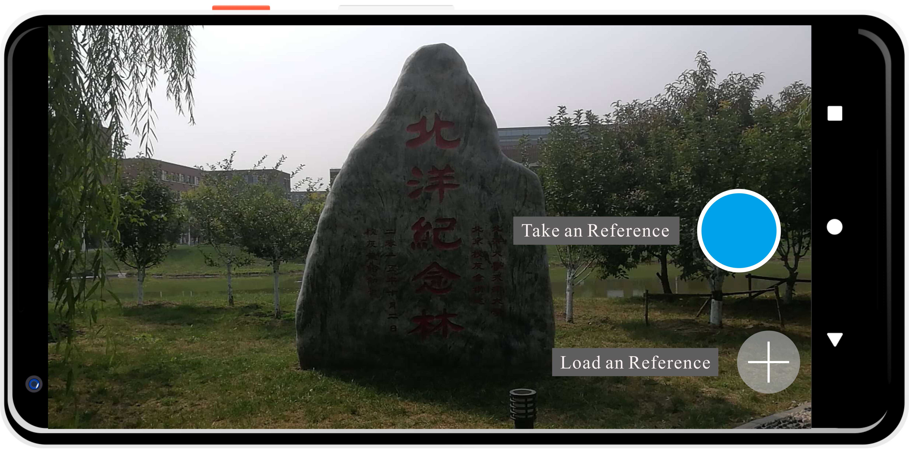
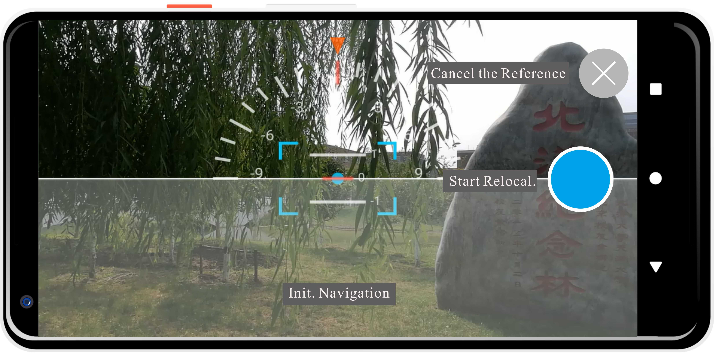

# Rephoto Android app

## Introduction

This is the beta App in Android for this paper:

>Y. Shi, F. Tian, D. Miao and W. Feng, [Fast and Reliable Computational Rephotography](https://ieeexplore.ieee.org/document/8486559) on Mobile Device in ICME 2018

Author: Yibo Shi (wu6shen at tju.edu.cn)

## Citation
If you want to use our App in your research, please cite:

```
@INPROCEEDINGS{ICME18REPHOTO,
  author={Y. {Shi} and F. {Tian} and D. {Miao} and W. {Feng}},
  booktitle={2018 ICME}, 
  title={Fast and Reliable Computational Rephotography on Mobile Device}, 
  year={2018},
  volume={},
  number={},
  pages={1-6},}
```

## Usage

### Install

* Install App on your phone.
* Add Storage & Camera permissions for this App. (Need manual setting in Setting) 

### Instructions

* First, you need learn how to adjust phone pose (translation and rotation) by navigation. In this process of rephotography, our goal is:
		* Make coincidence with red rectangle and blue rectangle (position and Yaw Axis).  
		* Pointer to zero of disc (Roll Axis).
		* Red baseline aligned with blue dot (Pitch Axis).

 

* Set reference image. (Load or Take photo)

 

* Start Rephoto.

 

* Rephoto (Move and Rotate).

Suggestion: rotate first.

 

* Finish Rephoto.

End of rephotography and decide whether you are satisfied with this result.

 

* Compare with reference image.

 
