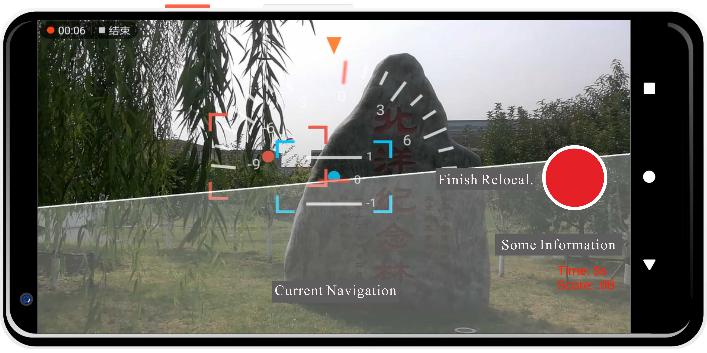

# Rephoto Android app

## Introduction

This is the beta App in Android for this paper:

>Y. Shi, F. Tian, D. Miao and W. Feng, [Fast and Reliable Computational Rephotography](https://ieeexplore.ieee.org/document/8486559) on Mobile Device in ICME 2018

Author: Yibo Shi (wu6shen at tju.edu.cn)

## Citation
If you want to use our App in your research, please cite:

```
@INPROCEEDINGS{ICME18REPHOTO,
  author={Y. {Shi} and F. {Tian} and D. {Miao} and W. {Feng}},
  booktitle={2018 ICME}, 
  title={Fast and Reliable Computational Rephotography on Mobile Device}, 
  year={2018},
  volume={},
  number={},
  pages={1-6},}
```

## Usage

### Install

* Install App on your phone.
* Add Storage & Camera permissions for this App. (Need manual setting in Setting).

### Instructions

* First, you need learn how to adjust phone pose (translation and rotation) by navigation. In this process of rephotography, our **goal** is:
  * Make coincidence with red rectangle and blue rectangle (position and Yaw Axis). 
  * Pointer to zero of disc (Roll Axis).
  * Red baseline aligned with blue dot (Pitch Axis).

 

#### Stage 1: Set reference image. (Load or Take photo)
In this stage, you can load a history image as the reference image or take a new photo as the reference image. (The current version only supports 1080p images and the images with same aspect ratio, i.e. `w:h=16:9`.)

 

#### Stage 2: Start Rephoto.
If you are satisfied with the current reference image, you push the center button and begin rephotography. If not, you can choose or take another image. 
 

#### Stage 3: Rephoto (Move and Rotate).
You need move the phone with navigation to achieve the **goal**. Suggestion: rotate first.

 

#### Stage 4: Finish Rephoto.
End of rephotography and decide whether you are satisfied with this result (You can judge the result according to the final navigation). 

 

#### Stage 5: Compare and save.
You can compare the rephotography result and reference image in this stage. If you want to **save** your image, don't forget push the save button. The result image will save in `/storage/rephoto`.  

 